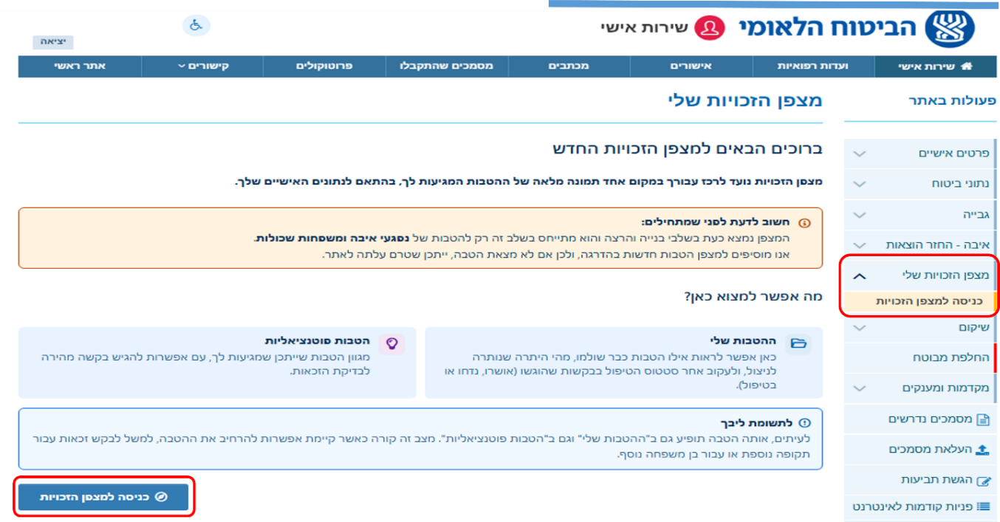
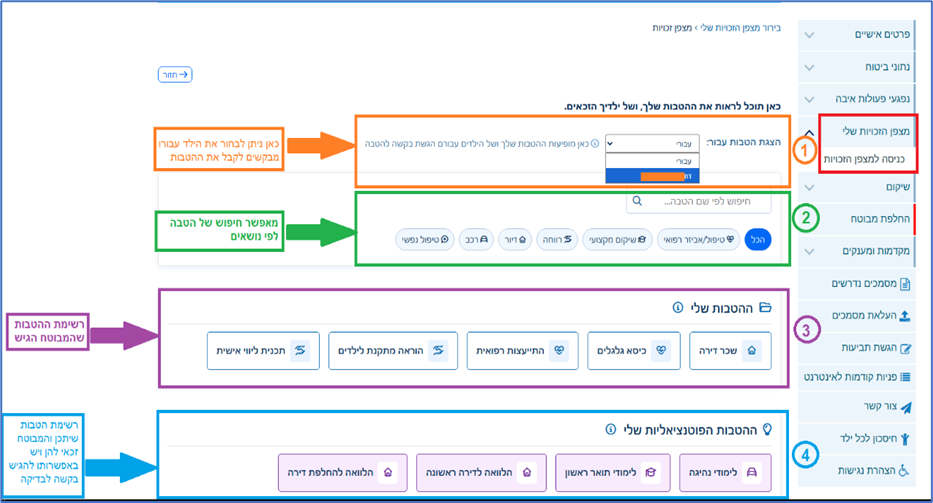
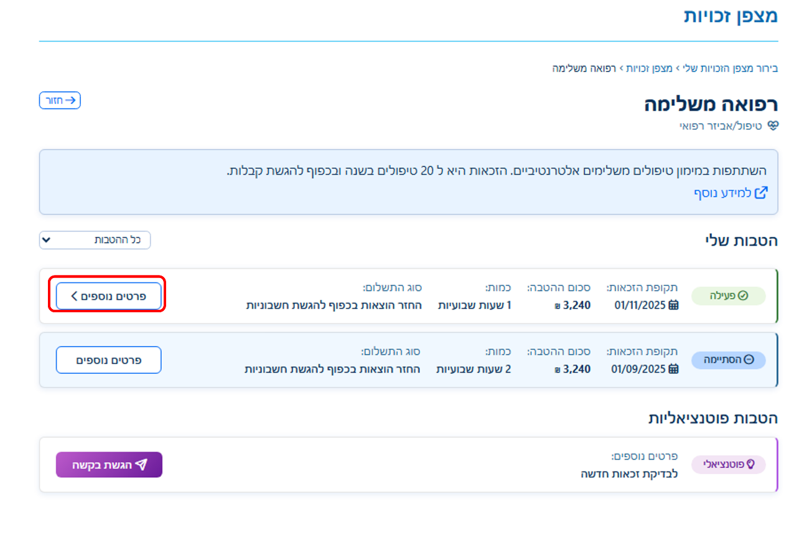
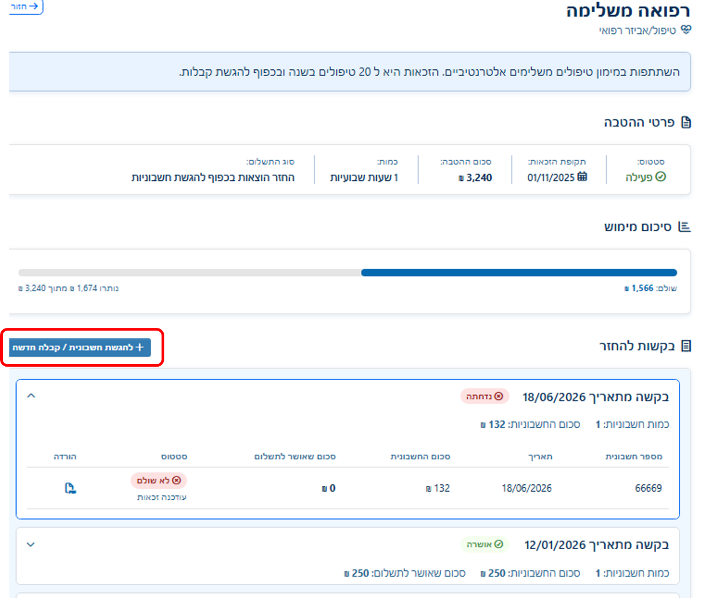
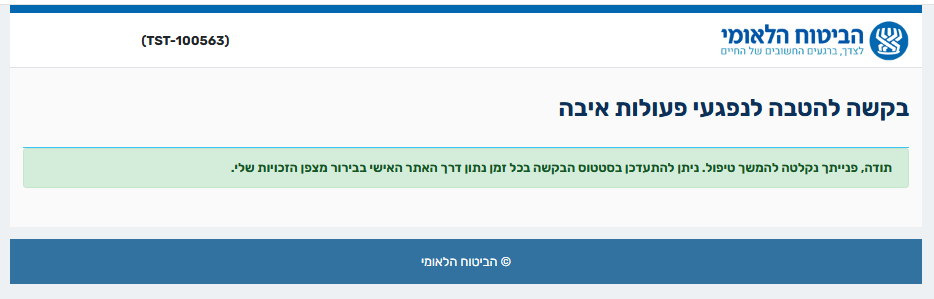
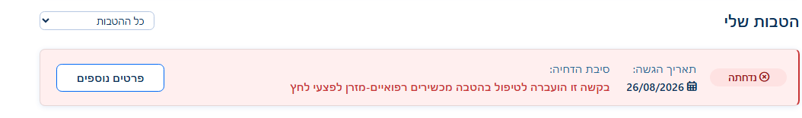

# מצפן הזכויות שלי – מדריך למבוטחים

> **מה זה המסמך הזה?** זהו הטקסט המלא של המדריך למבוטחים. הוא משמש כמקור אחד לכל התוצרים: המדריך האינטראקטיבי (`guide/index.html`), תסריט הווידאו (`video/script.md`) ומסמכים להדפסה.
> טקסטים בסוגריים מרובעים כפולים `[[כך]]` הם מקומות שצריך להשלים לפני פרסום.

---

## כל הזכויות וההטבות שלך במקום אחד

מצפן הזכויות מרכז עבורך מידע אישי על הזכויות וההטבות שלך כנפגע פעולות איבה. במצפן אפשר:

- **לגלות הטבות** שעשויות להתאים לך, ולבדוק כיצד ניתן להגיש בקשה למימושן.
- **לעקוב אחר ההטבות והבקשות שלך**, ולראות מה מצבן: בטיפול, פעילות, הסתיימו או נדחו.
- **לראות את פרטי ההטבה והמימוש שלה**, כולל תקופת הזכאות, היתרה שנותרה ובקשות להחזר שכבר הוגשו.
- **להגיש חשבוניות וקבלות להחזר** עבור הטבות פעילות, ישירות דרך המצפן.

> **חשוב לדעת לפני שמתחילים**
> המצפן נמצא כעת בשלבי בנייה והרצה. בשלב זה הוא מיועד להטבות של נפגעי איבה ומשפחות שכולות. אנחנו מוסיפים למצפן הטבות חדשות בהדרגה, ולכן ייתכן שהטבה מסוימת עדיין לא מופיעה בו.

---

## למי המצפן מיועד בשלב זה

- **נפגעי פעולות איבה** שיש להם תיק איבה מוכר.
- **משפחות שכולות** שהוכרו כתלויים בעקבות פעולת איבה.
- **ילדים קטינים** שיש להם תיק איבה או תיק שיקום עם הטבה פעילה. במקרה זה ההורה המוכר כנפגע איבה רואה את ההטבות של הילד בתוך המצפן שלו.

---

## שלב 1: איך נכנסים למצפן

1. היכנסו לאתר האישי של הביטוח הלאומי, כפי שאתם נכנסים בדרך כלל. [[קישור לאתר האישי]]
2. בתפריט "פעולות באתר" שבצד ימין, לחצו על **מצפן הזכויות שלי**.
3. לחצו על **כניסה למצפן הזכויות**. ייפתח דף הסבר קצר.
4. בתחתית דף ההסבר לחצו על הכפתור הכחול **כניסה למצפן הזכויות**.

**מה כתוב בדף ההסבר?** הדף מזכיר שהמצפן חדש ונמצא בבנייה, ומסביר בקצרה את שני החלקים העיקריים: "ההטבות שלי" ו"הטבות פוטנציאליות".

---

## שלב 2: מה רואים במסך הראשי

המסך הראשי של המצפן בנוי מארבעה אזורים, מלמעלה למטה:

### 1. הצגת הטבות עבור
כאן בוחרים עבור מי להציג את ההטבות: עבורכם או עבור אחד מילדיכם הקטינים.
**שימו לב:** אזור זה מופיע רק אם יש לכם ילדים קטינים שאתם מקבלים עבורם הטבות. אם אין, פשוט לא תראו אותו.

### 2. חיפוש וקטגוריות
אפשר לחפש הטבה לפי שם בתיבת החיפוש, או ללחוץ על אחת הקטגוריות כדי לסנן: טיפול / אביזר רפואי, שיקום מקצועי, רווחה, דיור, רכב, טיפול נפשי. לחיצה על "הכל" מציגה שוב את כל ההטבות.

### 3. ההטבות שלי
רשימת ההטבות שכבר ביקשתם, כל אחת ככרטיס. לחיצה על כרטיס פותחת את דף ההטבה, עם כל הפרטים והבקשות שהגשתם בה.

### 4. ההטבות הפוטנציאליות שלי
הטבות שלפי הנתונים שלכם ייתכן שאתם זכאים להן, אבל עדיין לא ביקשתם. לחיצה על כרטיס מאפשרת להגיש בקשה לבדיקת זכאות.

> **לתשומת לבכם:** לפעמים אותה הטבה תופיע גם ב"ההטבות שלי" וגם ב"ההטבות הפוטנציאליות שלי". זה קורה כאשר אפשר להרחיב את ההטבה, למשל לבקש אותה לתקופה נוספת או עבור בן משפחה נוסף.

---

## שלב 3: לגלות הטבה ולהגיש בקשה

ב"ההטבות הפוטנציאליות שלי" מוצגות הטבות שייתכן שמגיעות לכם לפי הנתונים האישיים שלכם, ועדיין לא ביקשתם אותן. המגוון רחב: לימודים והכשרה מקצועית, דיור והלוואות, טיפולים ואביזרים רפואיים, תמיכה נפשית ועוד.

לחיצה על כרטיס הטבה פותחת את פרטיה ואת האפשרות להגיש בקשה לבדיקת זכאות.

### שני מצבים אפשריים בלחיצה על הטבה

**הטבה שאפשר להגיש בה מיד.** הבקשה נבדקת על ידי המערכת, בלי צורך בהתערבות של עובד שיקום. אפשר לצרף קבלה כבר עכשיו, הבדיקה מהירה וברוב המקרים התשובה מתקבלת במהירות.

**הטבה שמתחילה בפנייה.** הבקשה נשלחת לגורם המקצועי המתאים, שבודק את הזכאות: מוקד רכב, מוקד דיור, או עובד השיקום. הסטטוס יתעדכן במצפן.

> **חשוב לדעת:** הגשת בקשה אינה מהווה אישור אוטומטי לקבלת ההטבה. הזכאות נבדקת על פי הקריטריונים שנקבעו בחוק ובהתאם למסמכים שהוגשו.

---

## שלב 4: טופס הבקשה, שלושה שלבים

בראש הטופס מופיע סרגל שמראה באיזה שלב אתם נמצאים.

### 1. פרטי ההטבה
ממלאים את **תאריך תחילת מימוש ההטבה**. אפשר להגיש עד שנה אחורה.

### 2. מסמכים נדרשים
מצרפים את החשבונית או הקבלה, ומזינים את פרטיה. כל הטבה דורשת מסמכים אחרים, לפי מה שהוגדר לה ולפי מה שרלוונטי למיצוי הזכאות. יש הטבות שדורשות קבלה בלבד, ויש שדורשות גם קבלה וגם אישור מקופת חולים.

| שדה | חובה | הערה |
|---|---|---|
| מספר חשבונית | כן | |
| תאריך חשבונית | כן | |
| סכום החשבונית כולל מע"מ | כן | |
| מספר מזהה ספק | לא | נותן השירות: תעודת זהות, חברה פרטית או עמותה רשומה |
| תקופה: מתאריך עד תאריך | לא | |
| כמות | לא | |

**חשבונית עם כמה פריטים:** אם על החשבונית מופיעים כמה פריטים, למשל כמה טיפולים, ממלאים תקופה מתאריך עד תאריך, את הכמות, ואת סכום החשבונית הכולל. כפתור "הוסף חשבונית" מאפשר לצרף חשבונית נוספת לאותה בקשה.

### 3. הצהרה וחתימה
מאשרים את ההצהרה וחותמים, בעכבר במחשב או באצבע על המסך בנייד. תאריך הגשת הבקשה ממולא אוטומטית.

אחרי השליחה ההטבה עוברת ל**"ההטבות שלי"**, ומשם אפשר להיכנס אליה ולראות בכל רגע את מצב הבקשה.

---

## שלב 5: הסטטוסים ומה הם אומרים

ליד כל הטבה מופיע סטטוס. זה מה שכל סטטוס אומר:

| סטטוס | משמעות | מה אפשר לעשות |
|---|---|---|
| **בטיפול** | הגשתם בקשה ועדיין לא התקבלה בה החלטה. | להמתין. הסטטוס יתעדכן כאן כשתתקבל החלטה. |
| **פעילה** | ההטבה אושרה ויש בה יתרה לניצול. | להגיש חשבוניות וקבלות להחזר. |
| **הסתיימה** | ההטבה נוצלה במלואה ולא נותרה בה יתרה. | לא ניתן להגיש בה קבלות נוספות. אם אתם חושבים שמגיעה לכם תקופה נוספת, בדקו ב"הטבות הפוטנציאליות". |
| **נדחתה** | הבקשה נדחתה. סיבת הדחייה מופיעה על הכרטיס. | לקרוא את סיבת הדחייה. בשאלות, פנו אלינו. [[פרטי יצירת קשר]] |
| **פוטנציאלי** | הטבה שעדיין לא ביקשתם וייתכן שאתם זכאים לה. | ללחוץ על "הגשת בקשה" ולבקש בדיקת זכאות. |

**מה מופיע על כל כרטיס הטבה?** תאריך תחילת הזכאות, סכום ההטבה, הכמות (למשל מספר שעות שבועיות או טיפולים), וסוג התשלום: תשלום חודשי, תשלום שנתי, תשלום חד-פעמי, או החזר הוצאות בכפוף להגשת חשבוניות.

---

## שלב 6: דף ההטבה ו"פרטים נוספים"

לחיצה על **פרטים נוספים** בכרטיס ההטבה פותחת את התמונה המלאה של ההטבה. הדף מחולק לשלושה חלקים:

### פרטי ההטבה
הסטטוס, תקופת הזכאות, סכום ההטבה, הכמות וסוג התשלום, בדיוק כפי שאושרו לכם.

### סיכום מימוש
פס התקדמות שמראה כמה מההטבה כבר נוצל וכמה עוד נשאר. למשל: "שולם 1,566 ₪, נותרו 1,674 ₪ מתוך 3,240 ₪". כך תמיד תדעו כמה עוד אפשר לנצל.

### בקשות להחזר
כל החשבוניות והקבלות שהגשתם בהטבה זו, מקובצות לפי תאריך הבקשה. לכל בקשה רואים את מספר החשבונית, התאריך, סכום החשבונית, הסכום שאושר לתשלום והסטטוס. לחיצה על סמל ההורדה מאפשרת לפתוח את הקבלה שהגשתם.

---

## שלב 7: איך מגישים חשבונית או קבלה להחזר

אפשר להגיש קבלות רק בהטבה במצב **פעילה** (כלומר, שיש בה יתרה).

1. היכנסו לדף ההטבה ולחצו על **פרטים נוספים**.
2. באזור "בקשות להחזר" לחצו על הכפתור הכחול **להגשת חשבונית / קבלה חדשה**.
3. ייפתח טופס מקוון. הפרטים שלכם וההטבה כבר ממולאים בטופס, כולל היתרה שנותרה לניצול.
4. צרפו את המסמכים הנדרשים להטבה זו, למשל החשבונית או הקבלה.
5. שלחו את הטופס.

לאחר השליחה תופיע הודעת אישור: "תודה, פנייתך נקלטה להמשך טיפול". מרגע זה הבקשה מופיעה במצפן, ותוכלו לעקוב אחרי הסטטוס שלה בכל זמן.

---

## מה קורה אחרי שהגשתם בקשה

- הבקשה מופיעה בדף ההטבה בסטטוס **בטיפול**.
- כשתתקבל החלטה, הסטטוס יתעדכן ל**אושרה** או **נדחתה**, ובבקשות להחזר יופיע הסכום שאושר לתשלום.
- **אם הקבלה שייכת להטבה אחרת:** לפעמים קבלה מוגשת בטעות בהטבה לא מתאימה. במקרה כזה אנחנו מעבירים אותה להטבה הנכונה, ועל הכרטיס תופיע ההודעה "בקשה זו הועברה לטיפול בהטבה [שם ההטבה]". הבקשה לא אבדה, היא ממשיכה להיות מטופלת בהטבה המתאימה.

---

## דברים שכדאי לדעת

- **המצפן מציג הטבות מהשנתיים האחרונות בלבד.** הטבות ישנות יותר לא יופיעו בו.
- **המצפן מתעדכן בהדרגה.** אם הטבה שאתם מכירים לא מופיעה, ייתכן שהיא עדיין לא נוספה למצפן. הזכאות שלכם לא נפגעת מכך.
- **ההטבות של ילדיכם הקטינים** מופיעות באותו מצפן. בחרו את שם הילד ב"הצגת הטבות עבור" כדי לראות אותן.
- **הכפתור "חזור"** בראש כל דף מחזיר אתכם למסך הקודם.

---

## שאלות ותשובות

ראו קובץ נפרד: `faq.md`.

---

## למי פונים בשאלות

[[להשלים: עובד/ת השיקום המלווה, מספר טלפון של המוקד, שעות מענה, קישור לטופס פנייה]]

בכל שאלה על המצפן או על הטבה מסוימת, אנחנו כאן בשבילכם.

